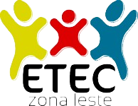

  
  

# Portfólio 2024 - Curso de Desenvolvimento de Sistemas (3DS)

Este repositório contém os arquivos referentes aos trabalhos desenvolvidos como parte do curso de Desenvolvimento de Sistemas (3DS) para comprovação do cumprimento das horas de estágio na IBM.
